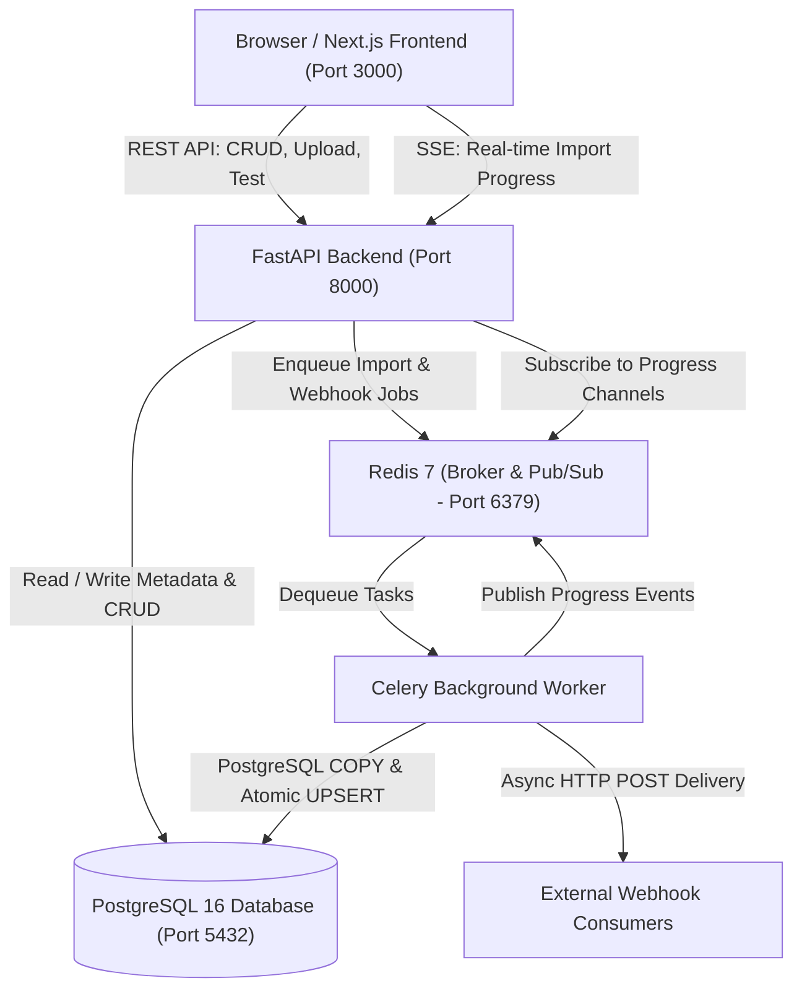

# Architecture & System Design: Assessment OPM

This document provides a detailed architectural specification of the Assessment OPM High-Performance Product Ingestion & Management System.

---

## 1. High-Level System Architecture



---

## 2. Ingestion Pipeline Mechanics: The 500K Problem

### 2.1 The Challenge
Importing 500,000 rows through an ORM using iterative `db.add()` and `db.commit()` statements results in:
- High memory pressure (>1.5 GB in Python).
- Extreme execution time (>20-30 minutes).
- Blocking web worker threads.
- Network and transaction round-trip saturation.

### 2.2 The Solution: Multi-Stage Staging with PostgreSQL COPY
The system leverages PostgreSQL's native engine primitives to ingest data at near disk/network I/O bandwidth:

```
[CSV on Disk] 
      │ 
      ▼
Stage 1: Streaming Validation (Generator in Python)
      - Chunks of 25,000 rows
      - Memory footprint capped at ~35 MB
      - Header & column length checks
      ▼
Stage 2: Bulk Staging via PostgreSQL COPY
      - Format data into clean TSV buffer
      - COPY into ephemeral unlogged staging table: staging_<job_id>
      - Minimal write-ahead-logging overhead
      ▼
Stage 3: SQL-Level Deduplication
      - Window/DISTINCT ON query:
        SELECT DISTINCT ON (LOWER(sku)) * FROM staging_<job_id>
        ORDER BY LOWER(sku), row_number DESC
      - Preserves later occurrence deterministically
      ▼
Stage 4: Set-Based Atomic UPSERT
      - Single SQL statement into products table:
        ON CONFLICT (LOWER(sku)) DO UPDATE SET
            name = EXCLUDED.name,
            description = EXCLUDED.description,
            updated_at = NOW()
      - Existing product active status is PRESERVED
      ▼
Stage 5: Cleanup & Progress Termination
      - DROP TABLE staging_<job_id>
      - Status -> COMPLETED
      - Publish final 100% progress event
```

---

## 3. Real-Time Telemetry & SSE

1. **Redis Pub/Sub Layer**:
   - Celery worker reports progress every 10,000 rows or stage transition to Redis channel `import_progress:{import_id}`.
2. **FastAPI SSE Gateway**:
   - `GET /api/v1/imports/{import_id}/progress` mounts an asynchronous generator.
   - Connects to the Redis Pub/Sub channel.
   - Initial burst sends the latest snapshot from PostgreSQL so client UI updates immediately even if connected mid-process.
   - Emits SSE formatted lines:
     ```text
     event: progress
     data: {"status": "IMPORTING", "progress": 65, "processed_rows": 325000, "total_rows": 500000}
     ```
   - Emits a periodic heartbeat `:keepalive` every 15 seconds to prevent browser or proxy connection termination.

---

## 4. Case-Insensitive SKU Uniqueness

- In e-commerce catalogues, SKU identifiers such as `PROD-001`, `prod-001`, and `Prod-001` represent the exact same product.
- **Enforcement at Database Level**:
  ```sql
  CREATE UNIQUE INDEX uq_products_sku_lower ON products (LOWER(sku));
  ```
- Any concurrent attempt to insert an identically cased or differently cased SKU raises a PostgreSQL unique constraint violation (`23505`).
- The backend catches this constraint and responds with a standard `409 Conflict` (`DUPLICATE_SKU`).

---

## 5. Webhook Subsystem & Security Architecture

```
Product / Import Event Triggered
            │
            ▼
Enqueue Celery Task (queue: webhooks)
            │
            ▼
Resolve Target Hostname (DNS Lookup)
            │
            ▼
SSRF Check: Is IP in Private / Loopback / Metadata Ranges?
      ├── YES ──> Abort delivery, log SSRF violation
      └── NO  ──> Execute HTTP POST with timeout (5s) & retry backoff (3 attempts)
```

### SSRF Protection Rules
The webhook validator enforces that destination IP addresses are publicly routable and rejects:
- `127.0.0.0/8` (Loopback)
- `10.0.0.0/8`, `172.16.0.0/12`, `192.168.0.0/16` (RFC 1918 Private)
- `169.254.169.254` (Cloud Provider Instance Metadata)
- `::1`, `fe80::/10` (IPv6 loopback and link-local)
- `0.0.0.0/8`
