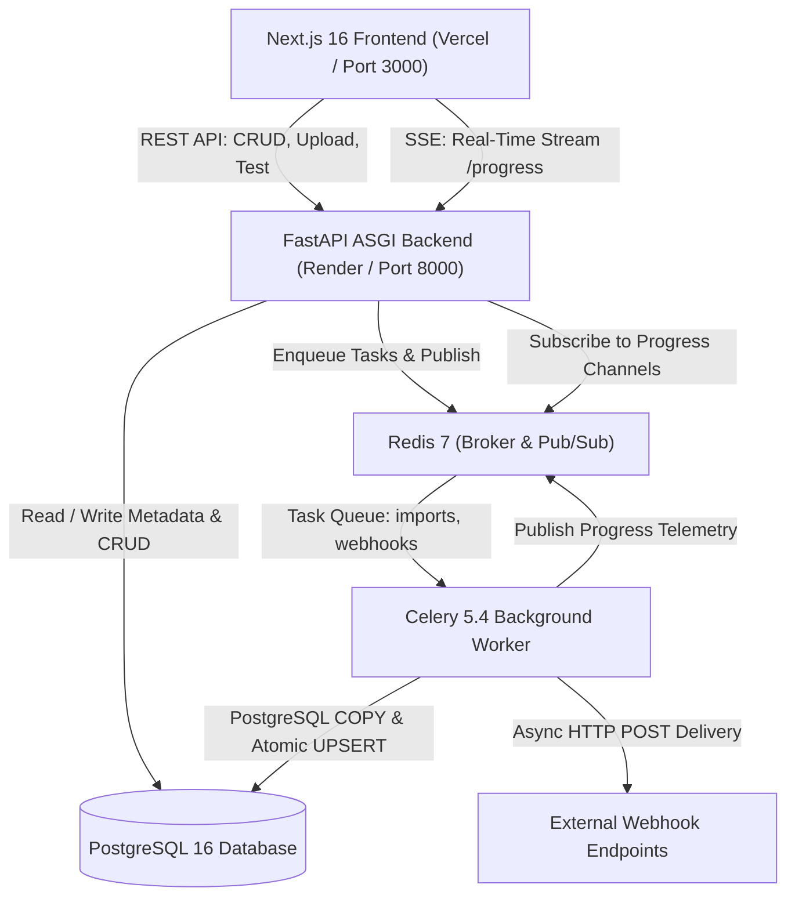

# Architecture & System Design: Assessment OPM

This document specifies the architectural design of the **Assessment OPM** high-performance product management and ingestion system.

---

## 1. High-Level Architecture



---

## 2. 500K CSV Ingestion Pipeline Mechanics

Importing 500,000 records through traditional ORM iteration (`db.add()`, `db.commit()`) requires >20 minutes and >1.5 GB RAM. Assessment OPM solves this using a two-pass streaming pipeline:

```
[CSV File on Disk (86.37 MB)]
       │
       ▼
Pass 1: Streaming Validation & In-Memory SKU Mapping (Python)
       - Header validation: ['name', 'sku', 'description']
       - Row-by-row format and required fields validation
       - Malformed/missing records buffered for import_errors
       - Deterministic latest-row deduplication: latest_sku_rows[sku.lower()] = row_idx
       - Memory footprint: ~57 MB RAM, completed in ~0.98s for 500K rows
       - Extracts winning_row_indices = set(latest_sku_rows.values()) (466,693 unique rows)
       ▼
Pass 2: Streaming PostgreSQL Binary COPY
       - Stream ONLY winning unique records directly into unlogged staging table
       - Assigns pre-computed chunk_id (1..5) on the fly
       - Batches of 25,000 rows via raw psycopg copy("COPY staging ... FROM STDIN")
       - Zero disk-thrashing intermediate tables or staging indexes
       ▼
Pass 3: Index Maintenance Optimization
       - Temporarily drops secondary indexes:
         • ix_products_name_trgm (GIN)
         • ix_products_sku_trgm (GIN)
         • ix_products_created_at (B-tree)
         • ix_products_active (B-tree)
       - Retains primary key (products_pkey) and unique lower index (uq_products_sku_lower)
       - Eliminates index write amplification by 40-50%
       ▼
Pass 4: Atomic Range-Chunked Catalogue UPSERT Merge
       - Executed in 5 bounded chunks within ONE single atomic transaction
       - ON CONFLICT (lower(sku)) DO UPDATE SET
             name = EXCLUDED.name,
             description = EXCLUDED.description,
             updated_at = NOW()
       - Existing active=false status is STRICTLY PRESERVED (active excluded from update)
       - Emits real honest progress events (70% → 90%)
       - On failure or cancellation, ROLLBACK ensures 0 partial rows in products
       ▼
Pass 5: Index Rebuild & Finalization
       - Rebuilds dropped indexes in sequential background passes with maintenance_work_mem = 64MB
       - Commits transaction atomically
       - Updates status to COMPLETED (100%)
       - Dispatches asynchronous import.completed webhook to Celery
```

---

## 3. Database Schema & Indexing Topology

### `products` Table
```sql
CREATE TABLE products (
    id BIGSERIAL PRIMARY KEY,
    sku VARCHAR(100) NOT NULL,
    name VARCHAR(255) NOT NULL,
    description TEXT NOT NULL DEFAULT '',
    active BOOLEAN NOT NULL DEFAULT TRUE,
    created_at TIMESTAMPTZ NOT NULL DEFAULT NOW(),
    updated_at TIMESTAMPTZ NOT NULL DEFAULT NOW()
);

-- Authoritative case-insensitive uniqueness
CREATE UNIQUE INDEX uq_products_sku_lower ON products (LOWER(sku));

-- Filtering & Sorting indexes
CREATE INDEX ix_products_active ON products (active);
CREATE INDEX ix_products_created_at ON products (created_at DESC);

-- Fast Substring & Trigram search indexes (pg_trgm extension)
CREATE INDEX ix_products_name_trgm ON products USING gin (name gin_trgm_ops);
CREATE INDEX ix_products_sku_trgm ON products USING gin (sku gin_trgm_ops);
```

---

## 4. Real-Time Telemetry & Progress Reporting

1. **Redis Pub/Sub Layer**:
   - The worker publishes updates to channel `import_progress:{job_id}` at every milestone (Parsing, Validating batch, Merging chunk, Rebuilding indexes, Completed).
   - Also caches the latest state in Redis key `import_latest:{job_id}` with a 1-hour TTL.
2. **FastAPI SSE Gateway (`/api/v1/imports/{id}/progress`)**:
   - Streams live JSON events over HTTP SSE to the browser.
   - Initial burst fetches the cached Redis state or DB record so mid-stream reconnections receive immediate status without waiting for the next update.
   - Heartbeat comments `:keepalive` emitted every 15s to keep proxies and firewalls open.
   - **No fake progress**: Percentages reflect real counted records and committed merge stages.

---

## 5. Security Architecture

1. **SSRF Mitigation for Webhooks**:
   - Private, internal, loopback, link-local, and cloud metadata IP ranges (`127.0.0.0/8`, `10.0.0.0/8`, `172.16.0.0/12`, `192.168.0.0/16`, `169.254.169.254`) are strictly blocked by DNS pre-resolution checks before any webhook request is dispatched.
2. **SQL Injection Prevention**:
   - All dynamic parameters in SQLAlchemy and raw PostgreSQL statements are parameterized using bind variables (`:id`, `:chunk_id`, etc.).
3. **Cancellation & Process Termination**:
   - Users can cancel active imports at any time via `POST /api/v1/imports/{id}/cancel`.
   - The backend tracks the PostgreSQL backend PID in Redis (`import_pg_pid:{job_id}`) and sends `SELECT pg_cancel_backend(pid)` to immediately terminate long-running queries without waiting for the next loop iteration.
   - Cancellation handlers trigger database `ROLLBACK`, clean up staging tables, and restore indexes.
